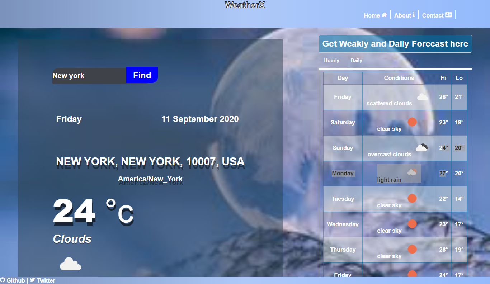
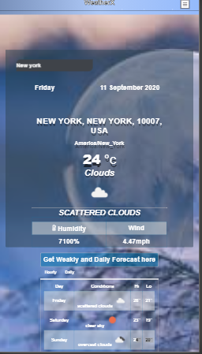

# PWA-WeatherApp v1
A progressive web application that get user desire weather conditions based on city, town or country from openweatherapi and locationiq.
<em> This was a practice project from GAD Mobile web specialist training in Learning phase 2. </em>

<h1>Mobile View </h1>

